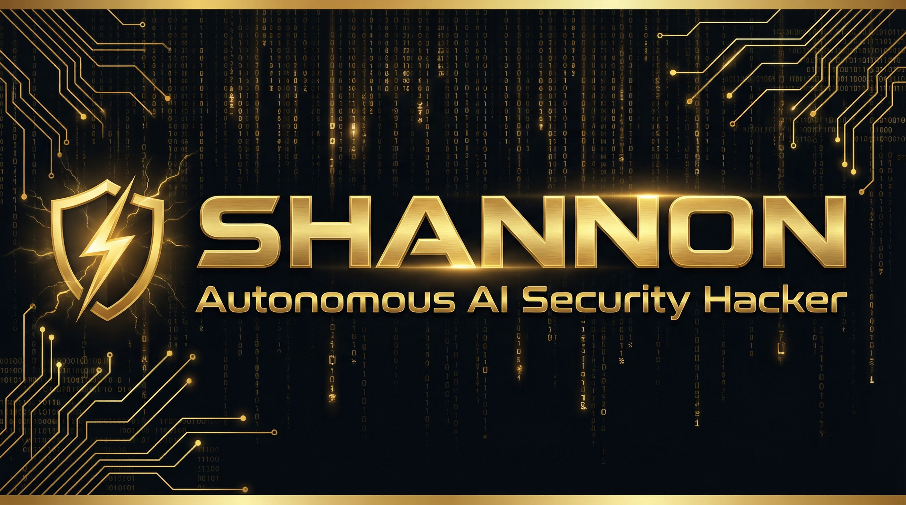

<!-- HEADER BANNER -->
<div align="center">
  
</div>

<div align="center">

[](https://www.typescriptlang.org/)
[](LICENSE)
[](https://keygraph.io/)
[](https://keygraph.io/)

</div>

> **Shannon is a fully autonomous AI pentester that delivers real, exploitable vulnerabilities — not just alerts.** It autonomously hunts for attack vectors in your code, then executes real exploits using its built-in browser to prove each vulnerability is actually exploitable. Achieving a **96.15% success rate** on the hint-free, source-aware XBOW Benchmark.

---

## The Problem

Thanks to AI-powered coding tools, your team ships code non-stop. But your penetration test happens once a year. This creates a massive security gap — for the other 364 days, you could be unknowingly shipping vulnerabilities to production. Shannon closes this gap by acting as your on-demand whitebox pentester.

## Key Features

| Feature | Description |
|---------|-------------|
| **Fully Autonomous** | Launch with a single command. Shannon handles 2FA/TOTP logins, browser navigation, and report generation with zero intervention |
| **Pentester-Grade Reports** | Delivers proven, exploitable findings with copy-and-paste Proof-of-Concepts — zero false positives |
| **OWASP Coverage** | Identifies and validates Injection, XSS, SSRF, and Broken Authentication/Authorization vulnerabilities |
| **Code-Aware Testing** | Analyzes source code to guide attack strategy, then performs live browser-based exploits |
| **Integrated Security Tools** | Leverages Nmap, Subfinder, WhatWeb, and Schemathesis for deep reconnaissance |
| **Parallel Processing** | Runs analysis and exploitation for all vulnerability types concurrently for faster results |

## Product Editions

| Edition | License | Best For |
|---------|---------|----------|
| **Shannon Lite** | AGPL-3.0 (Open Source) | Security teams, independent researchers, testing your own applications |
| **Shannon Pro** | Commercial | Enterprises requiring advanced features, CI/CD integration, and dedicated support |

## Quick Start

### Prerequisites

Ensure you have **Docker** and **Docker Compose** installed, along with an **Anthropic API key** (Claude).

### Installation

```bash
# Clone the repository
git clone https://github.com/Alexi5000/shannon.git
cd shannon

# Copy the environment template
cp .env.example .env

# Add your Anthropic API key to .env
echo "ANTHROPIC_API_KEY=your-key-here" >> .env

# Build and start Shannon
docker compose up --build
```

### Running a Scan

```bash
# Basic scan against your application
docker compose run shannon scan \
  --target https://your-app.com \
  --source ./path/to/source

# Scan with specific vulnerability focus
docker compose run shannon scan \
  --target https://your-app.com \
  --source ./path/to/source \
  --vulns injection,xss,auth
```

### Output

Shannon generates a comprehensive penetration testing report in the `reports/` directory, including proven exploits with reproducible Proof-of-Concepts, severity ratings, and remediation recommendations.

## Technology Stack

| Category | Technology |
|----------|-----------|
| **Language** | TypeScript |
| **AI Engine** | Anthropic Claude (Claude 3.5 Sonnet) |
| **Browser Automation** | Playwright |
| **Reconnaissance** | Nmap, Subfinder, WhatWeb, Schemathesis |
| **Containerization** | Docker & Docker Compose |
| **License** | AGPL-3.0 |

## Architecture

Shannon operates in three phases: **Reconnaissance** (code analysis + tool scanning), **Exploitation** (parallel browser-based attack execution), and **Reporting** (pentester-grade findings with PoCs). The AI agent coordinates all phases autonomously, using source code awareness to guide its attack strategy.

## Contributing

Contributions are welcome. Please read the existing contribution guidelines in the repository before submitting pull requests. All contributions must comply with the AGPL-3.0 license.

## License

This project is licensed under the **GNU Affero General Public License v3.0**. See the [LICENSE](LICENSE) file for details.

---

<div align="center">

**Maintained by [Alex Cinovoj](https://alexcinovoj.dev) | [TechTide AI](https://github.com/Alexi5000)**

*Originally created by [Keygraph](https://keygraph.io/)*

</div>
